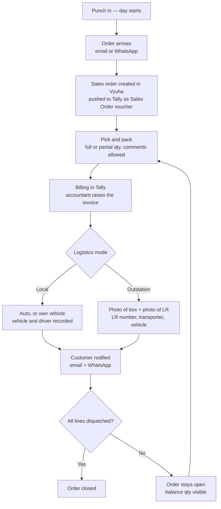

# 12 — Order to Dispatch: Flow Specification

Companion to `08-product-requirements-phase-6-8.md`. Requirement IDs continue past Z into **AA** and **AB**.
Belongs to Phase 8a. `11-decisions-phase-6-8.md` remains the authority on anything it covers.

This document describes one working day, end to end, for a physical order. It is the flow the business actually runs; everything in Area W and Area X exists to serve it.

---

## 1. The flow



Plain text, for anywhere Mermaid does not render:

```
  Punch in (day starts, 09:00)
        |
  Order arrives — email or WhatsApp
        |
  Sales order created in Vyuha ──push──▶ Tally (Sales Order voucher)
        |
  Pick and pack — full or partial, comments
        |
  Billing in Tally ──pull──▶ invoice projected back into Vyuha
        |
        ├── Local ──────▶ auto, or own vehicle (vehicle + driver)
        |                          |
        └── Outstation ─▶ box photo + LR photo, LR no., transporter, vehicle
                                   |
                        Customer notified — email + WhatsApp
                                   |
                  ┌────────────────┴────────────────┐
            all lines dispatched              balance remains
                    |                               |
              Order closed              Order open, balance visible
                                                    |
                                          back to Pick and pack
```

**Access window, running underneath all of it:** nobody but Admin can sign in between 19:30 and 09:00.

---

## 2. Stages and who owns each

| # | Stage | Actor | System | Produces |
|---|---|---|---|---|
| 1 | Punch in | Employee | Vyuha | Attendance day |
| 2 | Order received | Sales | Outside | An email or a WhatsApp message |
| 3 | Sales order entry | Sales | Vyuha → Tally | Sales Order voucher |
| 4 | Pick and pack | Picker | Vyuha | Pack record, packed quantities, comments |
| 5 | Billing | Accountant | **Tally** | Sales voucher, pulled back |
| 6 | Dispatch | Logistics | Vyuha → Tally | Delivery Note voucher, LR details, photos |
| 7 | Notification | System | Vyuha | Email + WhatsApp to the customer |
| 8 | Close | Derived | Vyuha | Order closed, or open with balance |

**Stage 5 is in Tally, not Vyuha.** This follows decision D-03's standing default. Vyuha does not raise the invoice; it waits for one to appear against the order and projects it back. Stage 6 cannot start until it has.

---

## 3. Requirements — Area AA: Order to dispatch

### 3.1 Quantities are the state

| ID | Requirement |
|---|---|
| REQ-AA-01 | Every sales order line carries **`ordered_qty`, `packed_qty`, `invoiced_qty`, `dispatched_qty`**. Every stage moves quantity from one to the next. |
| REQ-AA-02 | Order status is **derived from those quantities, never stored as an editable field**. A status column that can disagree with the lines will eventually disagree with the lines. |
| REQ-AA-03 | Derivation, evaluated per order: no line packed → `open`; some packed → `picking`; all packed, none invoiced → `awaiting_invoice`; invoiced, not fully dispatched → `partially_dispatched`; all lines fully dispatched → `closed`. |
| REQ-AA-04 | `packed_qty ≤ ordered_qty`, `invoiced_qty ≤ packed_qty`, `dispatched_qty ≤ invoiced_qty`. Enforced by database constraint, not by code. |
| REQ-AA-05 | An order may be **short-closed** with a reason by a holder of `sales.document.alter` — the customer cancelled the balance, or the item is discontinued. Recorded, audited, never silent. |

### 3.2 Picking and packing

| ID | Requirement |
|---|---|
| REQ-AA-06 | A **pick list** is generated from the sales order and worked on a phone. Line, item, ordered qty, and a field for packed qty. |
| REQ-AA-07 | The picker may pack **less than ordered**. The balance stays on the order and returns to the pick queue. |
| REQ-AA-08 | The picker may add a **comment per line and per order** — short supply, damage, substitution, anything the office needs to know. Comments are visible to sales and appear on the order. |
| REQ-AA-09 | Packing produces a **pack record**: box count, packed by, packed at, comments. One order may produce several pack records across days. |
| REQ-AA-10 | The pick screen is usable one-handed on a phone at 360px. A picker is holding a box. |

### 3.3 The billing handshake

This is the only place in the flow where Vyuha waits on a person working in another system, and it is where the flow will stall if it is built loosely.

| ID | Requirement |
|---|---|
| REQ-AA-11 | Once packed, the order enters **`awaiting_invoice`** and appears on a queue the accountant can see. |
| REQ-AA-12 | Vyuha detects the invoice on the next Tally pull and **links it to the sales order**. Linking method is decision D-21 — the default is Tally's own order reference on the sales voucher, with a manual link screen as the fallback. |
| REQ-AA-13 | An invoice that arrives with **no resolvable order** appears on an unlinked-invoice screen. It is never guessed at by party and date. |
| REQ-AA-14 | Dispatch is **blocked until an invoice covers the quantity being dispatched**. Goods do not leave the building ahead of the paperwork. |
| REQ-AA-15 | The awaiting-invoice queue shows how long each order has been waiting. An order waiting more than a configurable number of hours notifies the accountant. |

### 3.4 Dispatch

| ID | Requirement |
|---|---|
| REQ-AA-16 | A **dispatch** is its own record, not a field on the order. One order may have many dispatches; each carries its own lines and quantities. This is what makes partial shipment work rather than being tracked in someone's head. |
| REQ-AA-17 | Mode is one of **`local_auto`**, **`local_own_vehicle`**, **`outstation`**. |
| REQ-AA-18 | `local_own_vehicle` requires **vehicle number and driver name**. `local_auto` requires neither. |
| REQ-AA-19 | `outstation` requires **LR number, transporter name, transporter contact**, and optionally vehicle number and expected delivery date. |
| REQ-AA-20 | `outstation` requires **at least one photograph of the packed boxes and one photograph of the LR**, captured through the existing punch photo pipeline — magic-byte validation, server re-encode, EXIF stripped, signed URL, retention policy. It does not get its own upload path. |
| REQ-AA-21 | Photographs may be taken from the **camera or chosen from the gallery** for dispatch. This is deliberately different from punch, where REQ-D-02 forbids the gallery: an LR is a document that may have been scanned or received on WhatsApp, and there is no spoofing risk to defend against. |
| REQ-AA-22 | A dispatch pushes to Tally as a **Delivery Note** against the same party, carrying its lines and quantities. |
| REQ-AA-23 | A **dispatch board** shows everything in flight — by stage, by mode, by age — and is the logistics team's home screen. |

### 3.5 Customer notification

| ID | Requirement |
|---|---|
| REQ-AA-24 | On dispatch, the customer is notified by **email and WhatsApp** with: order reference, invoice number, items and quantities dispatched, balance remaining, transport mode, LR number and transporter where applicable, and the photographs. |
| REQ-AA-25 | Notification goes through the **existing notification dispatcher and channel abstraction** (REQ-Z-01). WhatsApp and email are channels, not a parallel system. |
| REQ-AA-26 | Until the WhatsApp API is integrated, the channel is **`manual`**: Vyuha composes the message and the photographs, the user sends them, and marks it sent. The record exists from day one; only the delivery mechanism changes later. Building the record later means the first months of dispatches have no notification history. |
| REQ-AA-27 | Every notification attempt is recorded: channel, recipient, sent at, status, failure reason. Visible on the order. |
| REQ-AA-28 | The customer's notification email and WhatsApp number come from the **Tally party master** where present, overridable per order. |

### 3.6 Partial shipment visibility

| ID | Requirement |
|---|---|
| REQ-AA-29 | Every order screen shows **ordered, packed, invoiced, dispatched and balance** per line. Not a status word — the numbers. |
| REQ-AA-30 | A **Pending dispatch** report lists every open order with a balance, by party, by age, by item. Under the existing report shell, exportable and schedulable. |
| REQ-AA-31 | An order's history shows every dispatch against it with its date, mode, LR and quantities. A customer asking "what happened to the other forty" gets an answer in one screen. |

---

## 4. Requirements — Area AB: Access window

| ID | Requirement |
|---|---|
| REQ-AB-01 | Sign-in is **refused between 19:30 and 09:00**, on the organisation's clock, not the device's. |
| REQ-AB-02 | The window is a **setting, not a constant**. Start time, end time, and which days it applies to are configurable, consistent with the weekly-off decision in `05-decisions` that nothing of this kind is hardcoded. |
| REQ-AB-03 | A new permission **`access.outside_window`** exempts its holder. Admin holds it. Nobody else does by default. |
| REQ-AB-04 | The refusal message states **when sign-in reopens**, and names the permission rather than saying "access denied". |
| REQ-AB-05 | **Active sessions are not terminated at 19:30.** Refresh is refused after the cutoff, so a session ends when its access token expires. A warning appears at 19:15. Hard-terminating mid-form loses somebody's work and teaches them not to trust the product. |
| REQ-AB-06 | **The punch endpoints are exempt from the window.** See §5 — this is not a detail. |
| REQ-AB-07 | The connector agent credential, background jobs, scheduled exports and the notification dispatcher are **outside the window entirely**. They are not user sign-ins and must keep running overnight. A test asserts a sync job completes at 23:00. |
| REQ-AB-08 | Every refused sign-in is audited, with the account and the time. Repeated attempts after hours are worth being able to see. |

---

## 5. Two conflicts to resolve before building this

Neither is a defect. Both will become one if they are built past without a decision.

### 5.1 The 19:30 cutoff versus punching out

`05-decisions` establishes that an IN punch with no OUT leaves the day **Pending until regularized**. `05-decisions` also sets one general shift.

Anyone who works past 19:30 cannot sign in to punch out. Their day goes Pending, and somebody raises a regularization the next morning. If people stay late even occasionally, this manufactures regularization load out of a rule intended to stop after-hours system access — and the fix will be to hand out `access.outside_window`, which dissolves the rule entirely.

REQ-AB-06 exempts the punch endpoints, which is the narrowest fix: a person can punch out at 21:00 but cannot open a report, edit an order, or see a customer's balance. If that is not what is wanted, the alternative is a grace window keyed to the shift's out time rather than a fixed clock.

**This needs your answer before Phase 8a.**

### 5.2 The offline punch queue crossing the window

An offline punch taken at 19:20 and synced at 19:45 must be accepted. The window governs **sign-in**, not the timestamp on a punch that has already happened. The sync endpoint is exempt under REQ-AB-07, and a test should assert exactly this case, because it is the one a reasonable implementation gets wrong.

---

## 6. New tables

```
sales_order_lines        -- extended: packed_qty, invoiced_qty, dispatched_qty
                            CHECK (packed_qty <= ordered_qty)
                            CHECK (invoiced_qty <= packed_qty)
                            CHECK (dispatched_qty <= invoiced_qty)

pack_records             -- sales_order_id, box_count, packed_by, packed_at, comment
pack_record_lines        -- pack_record_id, sales_order_line_id, qty, comment

dispatches               -- sales_order_id, mode, dispatched_by, dispatched_at,
                            lr_number, transporter_name, transporter_contact,
                            vehicle_number, driver_name, expected_delivery_date,
                            external_ref → Tally Delivery Note
dispatch_lines           -- dispatch_id, sales_order_line_id, qty
dispatch_attachments     -- dispatch_id, file_id, kind ('box' | 'lr')

dispatch_notifications   -- dispatch_id, channel, recipient, sent_at, status, error

access_windows           -- start_time, end_time, days_of_week, is_active
```

`dispatch_attachments.file_id` points at the existing `files` table. The dispatch photo pipeline is the punch photo pipeline with the gallery path allowed — same validation, same re-encode, same signed URLs, same retention job. No second file service.

---

## 7. Acceptance

- An order of 100 units, packed 60, invoiced 60, dispatched 60, shows a balance of 40 on every screen that mentions it, and returns to the pick queue.
- The same order's second dispatch of 40 closes it, and its history shows both dispatches with their LRs.
- An outstation dispatch cannot be saved without an LR number, a transporter, a box photograph and an LR photograph. Each missing field is named.
- A dispatch cannot be created for a quantity greater than the invoice covers. Verified at the API, not only in the UI.
- The customer notification carries the balance quantity, not only what was sent.
- Sign-in at 20:00 is refused for every role except Admin, and the message says when it reopens.
- A punch-out at 21:00 succeeds. The day is not Pending.
- An offline punch taken at 19:20 and synced at 19:45 is accepted with its original timestamp.
- A scheduled export and a Tally sync both complete at 23:00.

---

## 8. Open decisions this raises

| # | Question | Blocks | Recommended default in use |
|---|---|---|---|
| D-21 | **How does Vyuha match a Tally invoice back to its sales order?** | REQ-AA-12 | Tally's own order reference on the sales voucher, which requires the accountant to fill it. Fallback is a manual link screen listing unlinked invoices per party. Guessing by party and date is not an option — two orders for one customer in a week would silently cross. |
| D-22 | **Does the picker punch-in gate the pick queue?** Should someone absent be assignable work? | REQ-AA-06 | No gate. Attendance and fulfilment stay separate; coupling them means a punch failure stops dispatch. |
| D-23 | **Punch-out versus the 19:30 window** — §5.1 | REQ-AB-06 | Punch endpoints exempt. Everything else refused. |
| D-24 | **Who may short-close an order?** | REQ-AA-05 | `sales.document.alter` — Sales manager and Admin. It writes off revenue somebody expected, so it is a business decision. |
| D-25 | **Is a delivery confirmation or POD wanted for local delivery?** | REQ-AA-17 | Not built. The flow as described ends at dispatch. If a signature or a delivered-marking is wanted, it is another stage and another table. |
| D-26 | **Does the balance return to the same picker, or to a shared queue?** | REQ-AA-07 | Shared queue. Assigning it back to one person means an absence stalls the order. |
