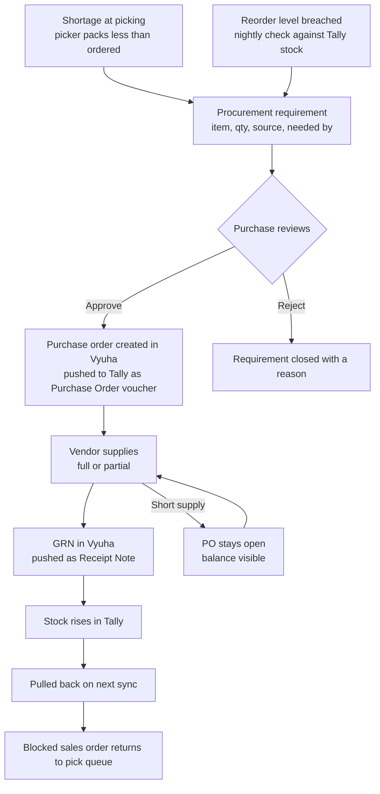

# 13 — Procurement: Shortage to GRN

Companion to `12-order-to-dispatch-flow.md`. Requirement IDs extend **Area X** (purchase documents, `08` §4) and add **Area AC** (stock availability).
Belongs to Phase 8a, alongside the sales side. `11-decisions-phase-6-8.md` remains the authority on anything it covers.

Doc `12` describes the order that flows. This describes the order that stops — because the stock is not there — and what un-stops it.

---

## 1. The loop



Two entry points, one exit. A requirement raised by a shortage carries its sales order; a requirement raised by a reorder breach carries none. Both become the same record and both are satisfied the same way.

---

## 2. The problem this has to solve first

**Vyuha does not hold stock. Tally does.** That is decision D-01 and it does not bend here.

So "the stock is over" is a Tally figure, arriving on a sync interval, and three things follow that must be designed rather than discovered:

**It is stale.** A picker seeing "12 in stock" is seeing what Tally said at the last pull. If the accountant billed 12 units directly in Tally five minutes ago, the picker is looking at a number that is no longer true.

**It is not the same as available.** Two open sales orders each needing 10 units will both look satisfiable against a closing balance of 12. Neither is wrong on its own; together they are.

**Vyuha therefore has to compute one number Tally cannot give it.** Available = Tally closing balance − quantity committed to open sales orders in Vyuha. The commitment half is Vyuha's own data and has no Tally equivalent, because those orders have not been billed yet.

This brushes against `09` §1.1 — Vyuha holding a figure Tally does not. It is permitted, and the boundary is worth stating precisely: **the committed quantity is an operational figure, not an accounting one.** It never appears in a statement, a ledger, or anything that reconciles to the books. It exists to stop two pickers promising the same box. If Vyuha's database were rebuilt from a backfill it would recompute from the open orders, which is the test `09` §1.1 sets.

---

## 3. Requirements — Area AC: Stock availability

| ID | Requirement |
|---|---|
| REQ-AC-01 | **Closing balance per item per godown** pulls from Tally with the stock item master, on the same AlterID-incremental basis (REQ-R-05). |
| REQ-AC-02 | **Reorder level and minimum order quantity** pull from Tally where the company maintains them. Where it does not, they are a Vyuha-owned field on the item — see D-28. |
| REQ-AC-03 | **Committed quantity** is computed by Vyuha: the sum of `ordered_qty − dispatched_qty` across open sales order lines for that item. Recomputed on any order change, never stored as a settable value. |
| REQ-AC-04 | **Available = closing balance − committed.** This is the number the picker and the salesperson see. |
| REQ-AC-05 | Every screen showing a stock figure shows **as-of which sync** (REQ-Y-07). A stock number that looks live and is forty minutes old causes a promise the business cannot keep. |
| REQ-AC-06 | A **low stock report**: items where available is at or below reorder level, with committed, available, open PO quantity and the shortfall. Under the existing report shell. |
| REQ-AC-07 | Vyuha **never writes a stock figure to Tally** except as a consequence of a Delivery Note or Receipt Note voucher. There is no adjustment path, no opening-stock entry, no correction screen. |
| REQ-AC-08 | On the estimate and sales order screens, item selection shows **available quantity alongside the existing price history affordance** (REQ-W-02). One control, two facts a salesperson needs at the same instant. |

---

## 4. Requirements — Area X extended: Procurement

`08` §4 already carries REQ-X-01 through X-05. These continue it.

### 4.1 Requirements as a record

| ID | Requirement |
|---|---|
| REQ-X-06 | A **procurement requirement** is a record: item, quantity, source, needed-by date, raised by, state. It is the thing a PO is built from. |
| REQ-X-07 | Source is one of **`shortage`** (carries the sales order and line that stalled) or **`reorder`** (carries none). |
| REQ-X-08 | A shortage at picking (REQ-AA-07) **automatically raises a requirement** for the unpacked balance. The picker does not have to remember to, and purchase does not have to read comments to find out. |
| REQ-X-09 | A **nightly job** raises requirements for items at or below reorder level, one per item, skipping items with an open PO already covering the shortfall. |
| REQ-X-10 | **One purchase order may satisfy several requirements**, and one requirement may be split across several POs. This is the reason requirements exist as records rather than as a flag on the order — three customers short of the same item is one call to the vendor, not three. |
| REQ-X-11 | A requirement may be **closed without a PO**, with a reason: customer cancelled, substitute offered, item discontinued. Recorded and audited. |
| REQ-X-12 | Requirements appear on a **procurement queue** — the purchase team's home screen — sorted by needed-by date, showing which customers are waiting behind each one. |

### 4.2 Building the purchase order

| ID | Requirement |
|---|---|
| REQ-X-13 | A PO is created **from selected requirements**, or standalone. Selecting requirements carries their items and quantities onto the PO and links them. |
| REQ-X-14 | On item selection, the PO shows **that item's purchase history from that vendor** — last rate, last quantity, last date, and the rate trend from the backfill. This is REQ-W-02's pattern applied to buying, and it is the same reason the backfill was worth its cost. |
| REQ-X-15 | **Preferred vendors per item** are a Vyuha-owned master — a deliberate exception to D-01, recorded as one in D-27 rather than allowed to drift into existence. Tally does not hold this reliably and purchase should not re-derive it from memory each time. |
| REQ-X-16 | A PO above a configured value requires approval through `platform/approvals` using `purchase.document.approve` (existing REQ-X-04). |
| REQ-X-17 | The PO pushes to Tally as a **Purchase Order voucher**, with the same sync state, idempotency and Alter semantics as every other pushed document (REQ-W-06, REQ-W-07). |
| REQ-X-18 | A PO may be sent to the vendor by **email and WhatsApp** through the same channel abstraction as the customer dispatch notification (REQ-AA-25), including the same `manual` fallback until the WhatsApp API lands. |

### 4.3 Receiving

| ID | Requirement |
|---|---|
| REQ-X-19 | PO lines carry **`ordered_qty`, `received_qty`**, with the same constraint discipline as `12` REQ-AA-04: `received_qty ≤ ordered_qty` enforced by database constraint. |
| REQ-X-20 | **Partial receipt is normal.** One PO may produce several GRNs. PO status is derived from quantities, never stored — the same rule as REQ-AA-02, for the same reason. |
| REQ-X-21 | A GRN records **quantity received, quantity rejected, and a reason for any rejection**. Rejected quantity does not increase stock and keeps the PO open. |
| REQ-X-22 | A GRN pushes as a **Receipt Note** voucher. The accountant books the purchase bill in Tally against it, and that bill is pulled back like any other voucher — the exact mirror of the sales-side handshake in `12` §3.3. |
| REQ-X-23 | A PO may be **short-closed** with a reason by a holder of `purchase.document.approve`, when the vendor will not supply the balance. |
| REQ-X-24 | **Open PO quantity is visible on the item** — how much is on order and expected when. Without it, purchase orders the same shortage twice. |

### 4.4 Closing the loop back to the order

| ID | Requirement |
|---|---|
| REQ-X-25 | When a GRN satisfies a requirement carrying a sales order, that **order returns to the pick queue** and its balance becomes packable. |
| REQ-X-26 | The waiting customer's order shows **why it is waiting and what it is waiting on** — the requirement, the PO, the vendor, the expected date. Sales answers "when will the rest come" from the order screen, not by asking purchase. |
| REQ-X-27 | Where several sales orders wait on one requirement, allocation of an insufficient receipt is **explicit, not first-come**. Purchase or sales decides who gets it, and the decision is recorded. |
| REQ-X-28 | The order returning to the queue notifies its owner, through the existing dispatcher. |

---

## 5. New tables

```
procurement_requirements
  id, item_id, qty, source ('shortage' | 'reorder'),
  sales_order_id (nullable), sales_order_line_id (nullable),
  needed_by, state ('open'|'ordered'|'received'|'closed'),
  raised_by (nullable — the nightly job raises with none),
  closed_reason, closed_by, closed_at

purchase_order_lines      -- extended: received_qty, rejected_qty
                             CHECK (received_qty + rejected_qty <= ordered_qty)

po_line_requirements      -- purchase_order_line_id, requirement_id, qty
                             many-to-many: REQ-X-10

grns                      -- purchase_order_id, received_by, received_at,
                             vendor_invoice_ref, external_ref → Receipt Note
grn_lines                 -- grn_id, purchase_order_line_id,
                             received_qty, rejected_qty, rejection_reason

item_vendors              -- item_id, party_id, is_preferred, lead_time_days
                             VYUHA-OWNED — see D-27

stock_positions           -- PROJECTION. item_id, godown_id, closing_balance,
                             reorder_level, minimum_order_qty,
                             connection_id, synced_at
                             no application write path
```

`stock_positions` is a projection and obeys `09` §4.3 — sync writer only, truncatable, rebuildable. `item_vendors` is not, and is the only Vyuha-owned master in the whole design.

---

## 6. Acceptance

- A sales order for 100 where only 60 can be packed raises a requirement for 40 automatically, with that order attached, and the order shows what it is waiting on.
- Two orders short of the same item produce two requirements, and one PO covering both. Receiving that PO releases both orders.
- Available quantity equals Tally closing balance minus committed, and drops when a second order is confirmed for the same item — verified without any sync running.
- A stock figure on screen carries its as-of timestamp, and the timestamp advances after a pull.
- A PO of 100 received as 60 accepted and 10 rejected leaves 40 outstanding, stays open, and shows the rejection reason.
- A GRN appears in Tally as a Receipt Note with the same lines and quantities. Checked by a person against Tally, for ten GRNs.
- Receiving stock that partially satisfies three waiting orders requires an explicit allocation decision and records who made it.
- The nightly reorder job raises no requirement for an item already covered by an open PO.
- There is no API path, under any permission including Admin, that writes a stock quantity directly. Verified by asserting 405 on every plausible route.

---

## 7. Open decisions this raises

| # | Question | Blocks | Recommended default in use |
|---|---|---|---|
| D-27 | **Preferred vendor per item — Vyuha-owned or not held at all?** | REQ-X-15 | **Vyuha-owned**, as the single exception to D-01. Tally has no dependable field for it, and the alternative is purchase re-deciding from memory on every PO. Recorded as an exception so it does not become a precedent for a second one. |
| D-28 | **Are reorder levels maintained in Tally today?** | REQ-AC-02 | Assuming **no**, so they become a Vyuha field on the item alongside D-27. If Tally does hold them, they pull with the master and Vyuha holds nothing. Worth checking before building either. |
| D-29 | **Does the business run multiple godowns in Tally?** | REQ-AC-01 | Assuming **one**. Multiple godowns mean availability is per location and a shortage in one is not a shortage overall, which changes REQ-AC-04 substantially. Cheap to check, expensive to retrofit. |
| D-30 | **Who allocates an insufficient receipt across waiting orders?** | REQ-X-27 | **Sales manager.** It decides which customer waits longer, which is a commercial call rather than a warehouse one. |
| D-31 | **Should a shortage requirement be raised automatically, or should the picker confirm it?** | REQ-X-08 | **Automatically.** A picker packing short has told the system everything it needs. Requiring a second action means requirements get missed on exactly the busy days they matter. |
| D-32 | **Is a purchase requisition and approval needed before a PO exists**, or is the requirement itself sufficient? | REQ-X-12 | The requirement is sufficient; approval sits on the PO by value (REQ-X-16). A separate requisition-approval step is a second queue and, at this scale, a second place for work to sit unread. |
| D-33 | **Vendor lead time — tracked, or not?** | REQ-X-26 | Tracked as a field on `item_vendors` and used to populate expected dates. Not enforced, not alerted on, until there is evidence anyone acts on it. |
